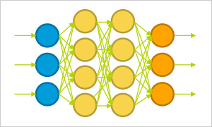
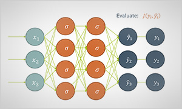
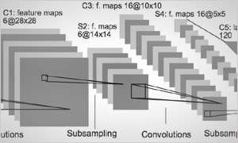

# AI Software Design
## This is a course for students majored in software engineering 
1. The purpose of this course 
    * Learn how to use Caffe Optimized for Intel® Architecture
    * Learn how to use Tensor Flow (Intel Optimized Tensor flow)
    * Practice the application of Caffe/Tensor Flow in software project
    * Use the already known AI algorithm such as CNN, RNN, LSTM etc.
    * Practice on source code version control using Github  

2. The contents
3. Course Evaluation
4. AI related models

...in building... 